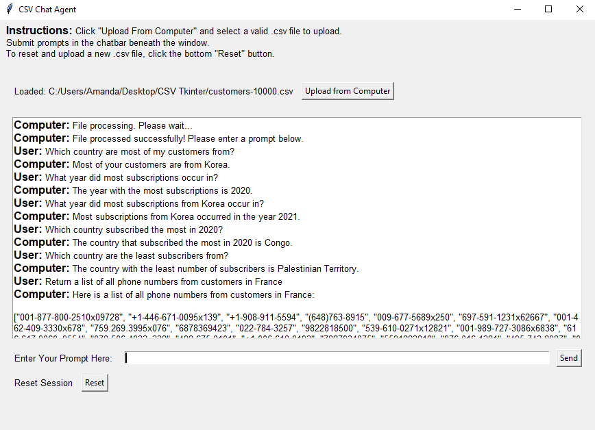

# LangChain CSV Agent Frontend

## Description

This is a basic Tkinter frontend that interfaces with a LangChain CSV agent on the backend. It allows you to upload a CSV file and ask questions, which the agent answers based on the data in the CSV file.
[Watch The Demo Video Here!](https://youtu.be/wsW8Sp6VYUw)

## Prerequisites

- Python 3.x
- A valid OpenAI API key

## Setup Instructions

1. **Clone the repository**  
   `git clone <https://github.com/amanda-cw/Langchain-CSV-Chat-Agent-with-Tkinter-GUI>`  
   `cd <Langchain-CSV-Chat-Agent-with-Tkinter-GUI>`

2. **Create a virtual environment**  
   `python -m venv venv`

3. **Activate the virtual environment**
   - On Windows:  
     `.\venv\Scripts\activate`
   - On macOS/Linux:  
     `source venv/bin/activate`

4. **Install the required packages**  
   `pip install -r requirements.txt`

5. **Add your OpenAI API key to a .env file**  
   `OPENAI_API_KEY=your_openai_api_key`

6. **Start the program**  
   `python frontend.py`

7. **Upload a CSV file**
   - Click on the "Upload CSV File" button.
   - Choose a valid CSV file (OpenAI has a context limit, so try to keep the file max 10-15k lines).

## Usage

Once the program is running, you can ask questions based on the data in the uploaded CSV file. The LangChain CSV agent will provide answers derived from the content of the CSV.

Enjoy using your LangChain CSV Agent Frontend!

## Functions and Tools Breakdown

### Frontend.py

- **create_fullscreen_app()**: Initializes and runs the main Tkinter application window. It sets up the interface, including instructions, file upload button, chatbox, input prompt, and reset button.

  - **upload_file()**: Handles file selection and loading the CSV file. It updates the chatbox with the processing status and results.
  - **send_prompt()**: Sends the user input prompt to the backend for processing and displays the response in the chatbox.
  - **restart_program()**: Restarts the application to allow re-uploading of a new CSV file.

### Backend.py

- **load_csv_agent(csv_file_path)**: Loads and creates the CSV agent using the specified CSV file. It handles any exceptions during the loading process and returns success or error messages.

- **process_prompt(prompt)**: Processes the user input prompt using the CSV agent and returns the generated response.

